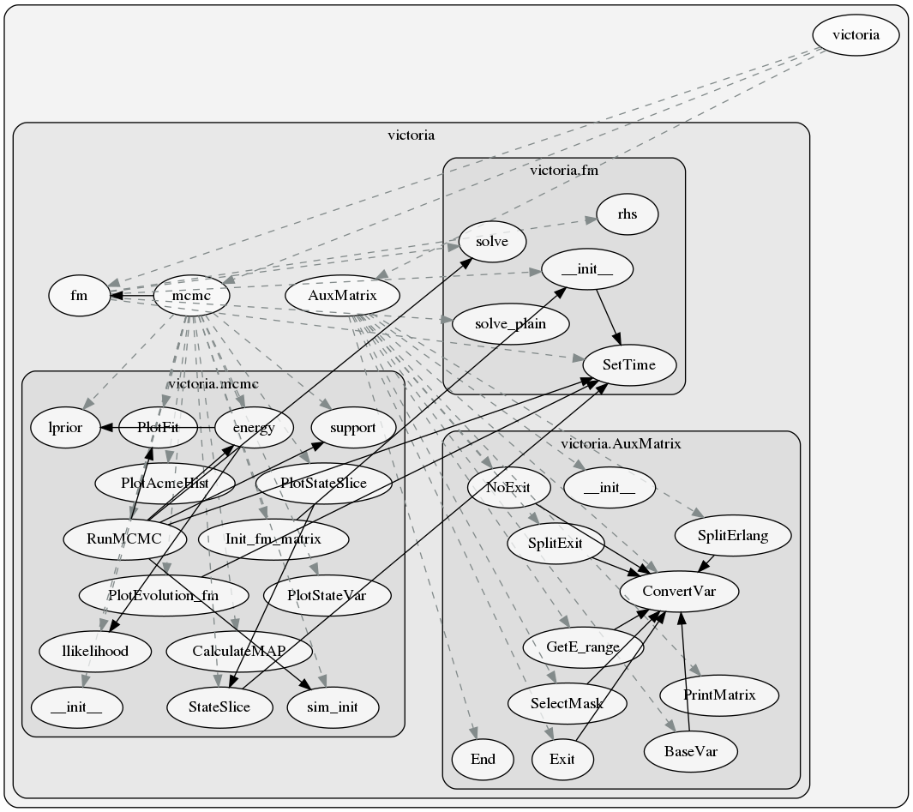

Victoria Base Modules
=====================

.. toctree::
    :maxdepth: 4
    
    twalk
    plotfrozen

Victoria Core Module
--------------------

Call graph of the core victoria module [#f1]_ .

.. automodule:: victoriaepi.victoria
    :members:
    :undoc-members:
    :show-inheritance:
    :inherited-members:
    :autosummary:

.. rubric:: Footnotes
.. [#f1] generated using `pyan <https://pypi.org/project/pyan3/>`_.
