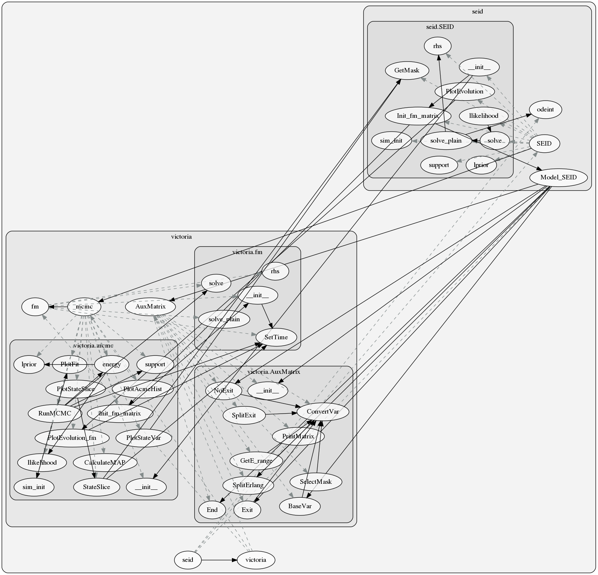
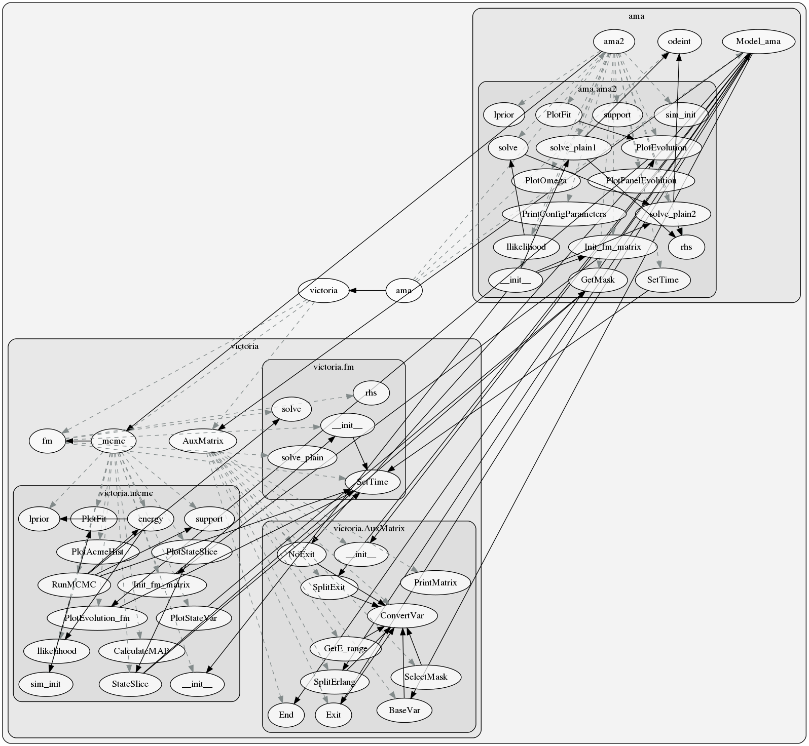
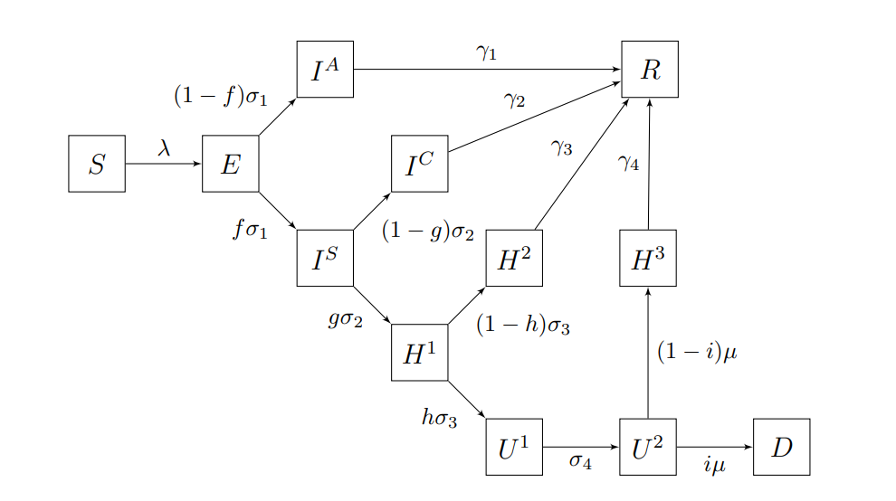
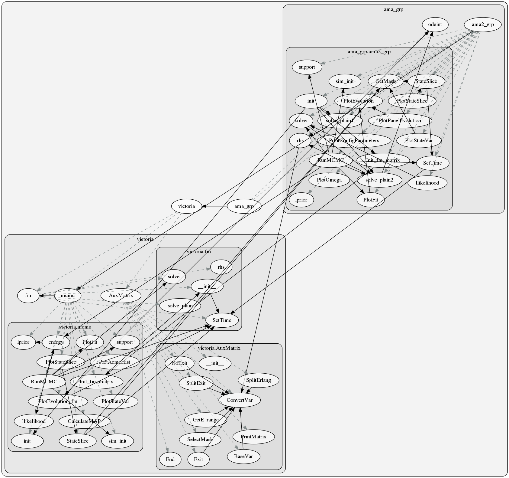

.. _Extended modules:

Extended modules
================

This section contains three extensions of the :class:`victoriaepi.victoria.mcmc` to solve several ODE models and parameter inference using Bayesian inference (MCMC with the twalk).
These extensions fill in the particular methods required to model different outbreaks:

* :meth:`victoriaepi.victoria.mcmc.llikelihood`
* :meth:`victoriaepi.victoria.mcmc.lprior`
* :meth:`victoriaepi.victoria.mcmc.rhs`
* :meth:`victoriaepi.victoria.mcmc.sim_init`
* :meth:`victoriaepi.victoria.mcmc.solve`
* :meth:`victoriaepi.victoria.mcmc.solve_plain`
* :meth:`victoriaepi.victoria.mcmc.support`

The provided extensions model the following:

* :ref:`seid module <seid module>` ODE model of a SEID model.
* :ref:`ama module <ama module>` ODE model of COVID19 pandemics including intervention dates.
* :ref:`ama_grp module <amagrp module>` ODE model of COVID19 pandemics with age groups.

You can look at the source code for each one of these classes to learn how to write your own extension:

:download:`seid.py <../victoriaepi/seid.py>`

:download:`ama.py <../victoriaepi/ama.py>`

:download:`ama_grp.py <../victoriaepi/ama_grp.py>`

or you can use the configparsing.config module to help you reduce the amount of boiler plate code.

.. _seid module:

seid module
-----------
 ODE model of a SEID model, and parameter inference using Bayesian inference (MCMC with the twalk).

Call graph of the :mod:`victoriaepi.seid` module including its relations to :mod:`victoriaepi.victoria` [#f1]_ .

.. automodule:: victoriaepi.seid
   :members:
   :undoc-members:
   :show-inheritance:
   :autosummary:
   :inherited-members:
   
   
Example of use
""""""""""""""

The following steps show how to use this class.

1. Download the file :download:`AnalyzeEyam.py <../victoriaepi/examples/AnalyzeEyam.py>`

or copy the following code to a file

.. literalinclude:: ../victoriaepi/examples/AnalyzeEyam.py

2. Create a subfolder named `data` and place :download:`Eyam.csv <../victoriaepi/examples/data/Eyam.csv>` into it

3. Run ``$ python AnalyzeEyam.py``

If everything worked right you should see something like: 

.. code-block:: text
	
	$ python AnalyzeEyam.py
	File with mcmc samples does not exist, run RunMCMC first.
	S --> E
	E --> I
	I --> D
	pytwalk: Running the twalk with 2000 iterations .  Wed, 04 Nov 2020, 13:57:25.
		   Finish in approx. 1 min and 15 sec.
	pytwalk: finished, Wed, 04 Nov 2020, 13:57:52.
	AutoMaxlag: maxlag= 72.

	Effective sample size: 41
	Sampling 42 model solutions.

	Saving files in  ./output/Eyam_*.pkl

.. _ama module:

ama module
----------

ODE model of COVID19 pandemics, and parameter inference using Bayesian inference (MCMC with the twalk).

Call graph of the :mod:`victoriaepi.ama` module including its relations to :mod:`victoriaepi.victoria` [#f1]_ .

Schematic diagram of model compartments without Erlang sub-compartments. For
a precise definition of parameters see https://arxiv.org/abs/2006.01873

.. automodule:: victoriaepi.ama
   :members:
   :undoc-members:
   :show-inheritance:
   :inherited-members:
   :autosummary:

.. _ama module example:

Example of use
""""""""""""""

The following steps show how to use this class.

1. Download the file :download:`AnalysisMZ.py <../victoriaepi/examples/AnalysisMZ.py>`

2. Create a subfolder named `data` and place :download:`9-01.csv <../victoriaepi/examples/data/9-01.csv>` 
and :download:`9-01_DinHosp.csv <../victoriaepi/examples/data/hosp/9-01_DinHosp.csv>` as follows:

.. code-block:: text

	.
	├── AnalysisMZ.py
	└── data
	    ├── 9-01.csv
	    └── hosp
	        └── 9-01_DinHosp.csv

3. Run ``$ python AnalysisMZ.py``

If everything worked right you should have this new structure:

.. code-block:: text

	.
	├── AnalysisMZ.py
	├── csv
	│   ├── 9-01_D_long.csv
	│   ├── 9-01_D_short.csv
	│   ├── 9-01_Hs.csv
	│   ├── 9-01_I_long.csv
	│   ├── 9-01_I_short.csv
	│   └── 9-01_U1.csv
	├── data
	│   ├── 9-01.csv
	│   └── hosp
	│       └── 9-01_DinHosp.csv
	├── figs
	│   ├── 9-01_D_long.png
	│   ├── 9-01_D_short.png
	│   ├── 9-01_Hs.png
	│   ├── 9-01_I_short.png
	│   ├── 9-01_Omega_f.png
	│   ├── 9-01_Omega.png
	│   ├── 9-01_R.png
	│   └── 9-01_U1.png
	└── output
	    ├── 9-01_samples.pkl
	    ├── 9-01_solns.pkl
	    └── 9-01_solns_plain.pkl

 

.. _amagrp module:

ama\_grp module
---------------

ODE model of COVID19 pandemics, including segmentation by age proportions.

Call graph of the :mod:`victoriaepi.ama_grp` module including its relations to :mod:`victoriaepi.victoria` [#f1]_ .

Schematic diagram of model compartments without Erlang sub-compartments. For
a precise definition of parameters see https://arxiv.org/abs/2006.01873

.. automodule:: victoriaepi.ama_grp
   :members:
   :undoc-members:
   :show-inheritance:
   :inherited-members:
   :autosummary:

Example of use
""""""""""""""

To use this class you can follow the same steps as showed in the example of the :ref:`ama module <ama module example>` but using this file instead :download:`AnalysisMZ_grp.py <../victoriaepi/examples/AnalysisMZ_grp.py>`

.. rubric:: Footnotes
.. [#f1] generated using `pyan <https://pypi.org/project/pyan3/>`_.
