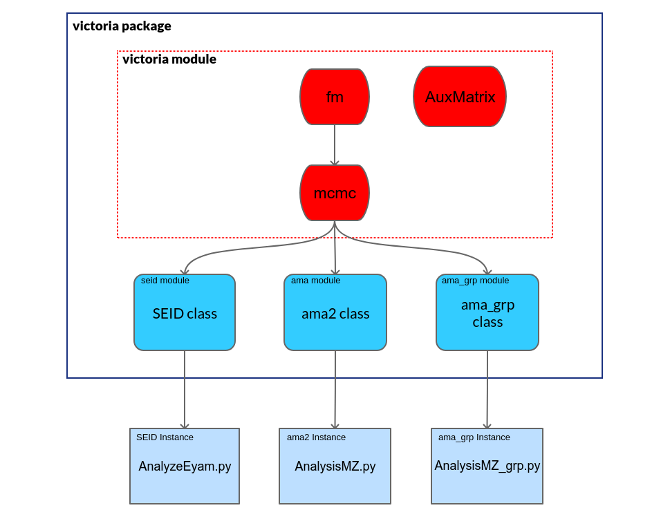

Victoria Package
================

.. toctree::
    :maxdepth: 4
    :caption: Table of Contents

    victoriabase
    Victoria Extended <victoriaextended>
    victoria.configparsing

Quick Summary
-------------

The following image is a quick overview of the class hierarchy in order to get a broad understanding of how the package is organized.

The red color represents the victoria core module :mod:`victoriaepi.victoria`, where you can find three classes:  :class:`victoriaepi.victoria.fm`, :class:`victoriaepi.victoria.mcmc` and :class:`victoriaepi.victoria.AuxMatrix`. 

*  :class:`victoriaepi.victoria.fm` is a template class, in which one needs to fill the methods: rhs, solve_plain, solve, in order to set the dynamics of the boxes in the forward map. 

* :class:`victoriaepi.victoria.mcmc`  is the main victoria epidemics ODE model, where Bayesian inference is implemented to get the initial conditions. Here the MCMC sampling method is used to overcome the computational difficulties related to Bayesian inference. This is performed with the twalk module :mod:`victoriaepi.pytwalk`.

* :class:`victoriaepi.victoria.AuxMatrix` is an auxiliary class that defines the ODE transition matrix to build models.

In order to use this, the :class:`victoriaepi.victoria.mcmc` class needs to be extended to the particular disease to be modeled. With this package, we are including the following classes which extend the mcmc class:
 
* :class:`victoriaepi.seid.SEID`
* :class:`victoriaepi.ama.ama2`
* :class:`victoriaepi.ama_grp.ama2_grp`

To instantiate each one of these, please refer to their respective example sections:

* :ref:`seid module <seid module>` ODE model of a SEID model.
* :ref:`ama module <ama module>` ODE model of COVID19 pandemics including intervention dates.
* :ref:`ama_grp module <amagrp module>` ODE model of COVID19 pandemics with age groups.

